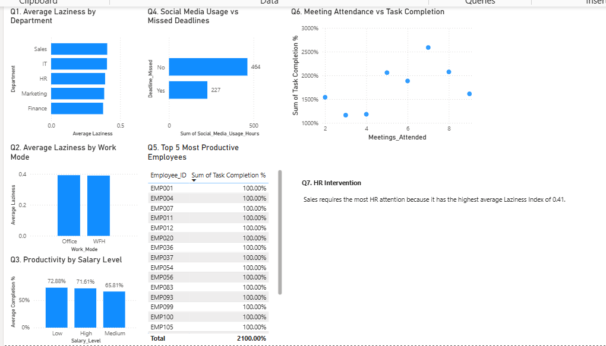
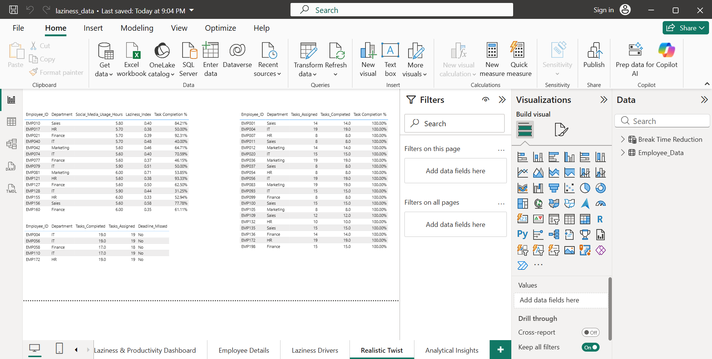
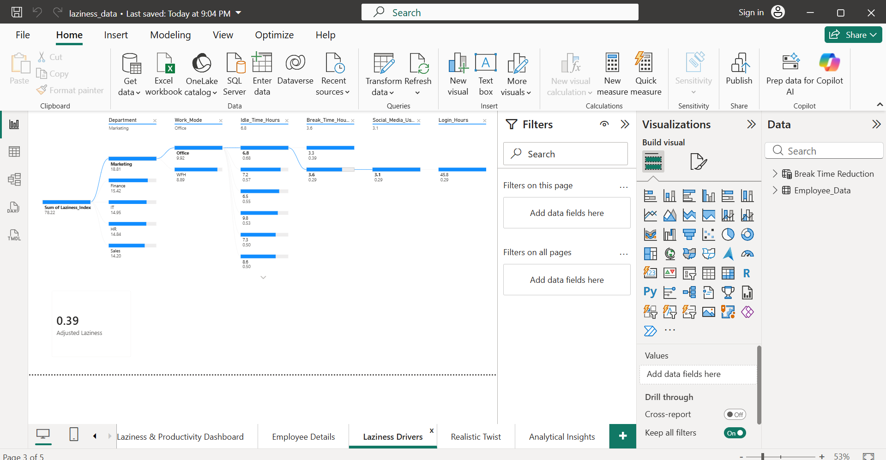
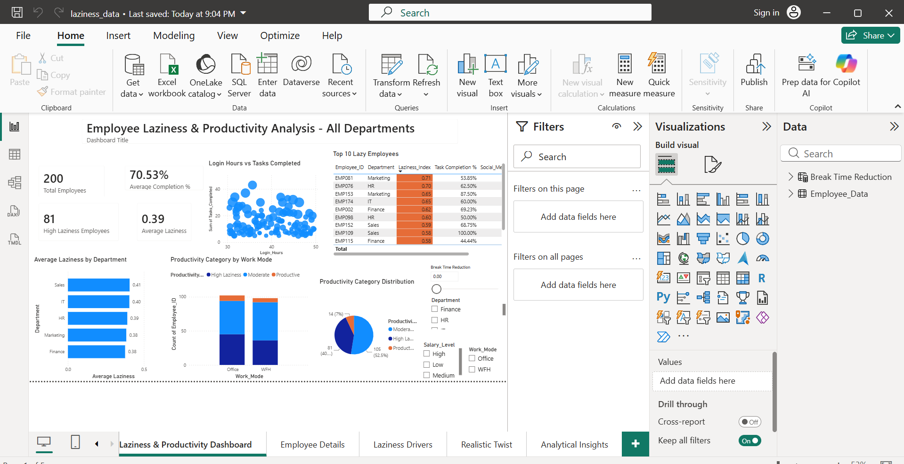

# 📊 Employee Laziness & Productivity Analysis

A Power BI dashboard project analyzing employee productivity, workplace laziness, work patterns, and behavioral factors using 200 employee activity records.

---

## 📌 Project Overview

This project analyzes employee activity data to identify productivity patterns and workplace laziness.

The dashboard uses **Power BI and DAX** to calculate a Laziness Index and provide business-focused insights related to employee productivity, work mode, social media usage, deadlines, meetings, salary levels, and departmental performance.

---

## 🖥️ Dashboard Preview

### Main Dashboard



### Employee Details



### Laziness Drivers



### Analytical Insights



---

## 🎯 Objectives

- Analyze employee productivity
- Identify departments with higher laziness levels
- Compare WFH and Office work modes
- Analyze social media usage and missed deadlines
- Compare salary levels and productivity
- Identify highly productive employees
- Identify departments requiring HR attention
- Explore employee work patterns
- Support data-driven HR decision-making

---

## 🛠️ Tools & Technologies

- **Microsoft Power BI**
- **DAX**
- **CSV**
- **Data Analysis**
- **Data Visualization**
- **Business Intelligence**

---

## 📈 Dashboard Features

The Power BI report includes:

- KPI Cards
- Average Laziness by Department
- Productivity Category by Work Mode
- Productivity Category Distribution
- Login Hours vs Tasks Completed
- Top 10 Lazy Employees
- Interactive Slicers
- Employee Drillthrough
- Decomposition Tree
- What-If Analysis
- Realistic Employee Scenarios
- Analytical Insights
- Conditional Formatting
- Dynamic Dashboard Title

---

# 📑 Dashboard Pages

## 1. Laziness & Productivity Dashboard

The main dashboard provides an overall view of employee productivity and laziness.

### Key Metrics

- Total Employees
- Average Task Completion
- High Laziness Employees
- Average Laziness

### Key Visuals

- Average Laziness by Department
- Productivity Category by Work Mode
- Productivity Category Distribution
- Login Hours vs Tasks Completed
- Top Lazy Employees
- Interactive Filters

---

## 2. Employee Details

The Employee Details page provides employee-level information for detailed analysis.

### Employee Information

- Employee ID
- Department
- Work Mode
- Login Hours
- Active Work Hours
- Idle Time Hours
- Break Time Hours
- Tasks Assigned
- Tasks Completed
- Deadline Missed
- Meetings Attended
- Social Media Usage Hours
- Performance Rating
- Salary Level
- Laziness Index
- Productivity Category
- Task Completion %

This page allows users to examine individual employee performance and work behavior.

---

## 3. Laziness Drivers

The Laziness Drivers page uses a **Decomposition Tree** to explore factors contributing to the Laziness Index.

The analysis can be explored through:

- Department
- Work Mode
- Idle Time Hours
- Break Time Hours
- Social Media Usage Hours
- Login Hours

A **What-If Parameter** is also included to analyze the potential impact of reducing break time.

---

## 4. Realistic Twist

The Realistic Twist page presents realistic employee-level scenarios and supporting tables for business analysis.

The analysis includes:

- Social Media Usage
- Laziness Index
- Task Completion
- Tasks Assigned
- Tasks Completed
- Missed Deadlines

This page provides detailed employee-level information for practical business analysis.

---

## 5. Analytical Insights

The Analytical Insights page uses visual analysis to investigate important business questions.

The page focuses on:

- Department-level laziness
- Work mode comparison
- Salary level and productivity
- Social media usage and missed deadlines
- Employee productivity
- Meeting attendance and task completion
- HR intervention areas

---

# 📊 Business Questions

The dashboard addresses the following business questions:

1. Which department has the highest average laziness?
2. Is WFH more associated with laziness?
3. Does salary level impact productivity?
4. What is the relationship between social media usage and missed deadlines?
5. Who are the top 5 most productive employees?
6. Is meeting attendance affecting task completion?
7. Which department needs HR intervention?

---

# 📁 Dataset

The dataset contains **200 employee activity records**.

## Main Fields

- Employee ID
- Department
- Work Mode
- Login Hours
- Active Work Hours
- Idle Time Hours
- Break Time Hours
- Tasks Assigned
- Tasks Completed
- Deadline Missed
- Meetings Attended
- Social Media Usage Hours
- Performance Rating
- Salary Level
- Laziness Index
- Productivity Category
- Task Completion %

---

# 📌 Laziness Index

The project uses the **Laziness Index** to classify employee productivity.

| Laziness Index | Category |
|---|---|
| `< 0.25` | Productive |
| `0.25 – 0.40` | Moderate |
| `≥ 0.40` | High Laziness |

### Classification

- **Productive:** Index < 0.25
- **Moderate:** Index 0.25–0.40
- **High Laziness:** Index ≥ 0.40

---

# 🔍 Advanced Analysis

The project includes several Power BI features:

- Dynamic Dashboard Title
- Conditional Formatting
- Employee Drillthrough
- Decomposition Tree
- What-If Parameter
- Interactive Slicers
- Realistic Employee Scenarios
- Analytical Insights

---

# 🌳 Decomposition Tree

The Decomposition Tree is used to explore the Laziness Index through multiple dimensions.

The available dimensions include:

- Department
- Work Mode
- Idle Time Hours
- Break Time Hours
- Social Media Usage Hours
- Login Hours

This allows users to interactively explore different factors associated with Laziness Index values.

---

# 🎚️ What-If Analysis

A What-If parameter is included to analyze the potential impact of **reducing break time**.

This allows users to explore hypothetical scenarios and examine potential changes in the adjusted Laziness Index.

---

# 🎛️ Interactive Analysis

The dashboard provides interactive filters and slicers for exploring different employee groups.

Available filters include:

- Department
- Work Mode
- Salary Level
- Break Time Reduction

Users can combine filters to investigate specific employee groups and productivity patterns.

---

# 📸 Dashboard Screenshots

All dashboard screenshots are available in the `screenshots/` folder.

| Screenshot | Description |
|---|---|
| `Dashboard1.png` | Main Productivity Dashboard |
| `Dashboard2.png` | Employee Details |
| `Dashboard3.png` | Laziness Drivers |
| `Dashboard4.png` | Analytical Insights |

---

# 📂 Project Files

| File | Description |
|---|---|
| `laziness_data.pbix` | Power BI project file |
| `Laziness_Analysis_200_Records.csv` | Source dataset |
| `screenshots/` | Dashboard screenshots |
| `README.md` | Project documentation |

---

# 💡 Key Business Value

This analysis can help organizations:

- Identify departments with higher Laziness Index levels
- Monitor employee productivity
- Compare different work modes
- Understand employee work patterns
- Analyze productivity-related behavioral factors
- Identify employees requiring attention
- Support HR decision-making
- Explore potential relationships between work habits and performance
- Perform scenario-based productivity analysis

---

# 🚀 How to Use

1. Download the `laziness_data.pbix` Power BI file.
2. Open the file using **Microsoft Power BI Desktop**.
3. Explore the available dashboard pages.
4. Use the available slicers and filters.
5. Interact with the visuals to analyze employee productivity.
6. Use the Employee Details page for employee-level analysis.
7. Use the Decomposition Tree for deeper analysis.
8. Use the What-If parameter to explore different scenarios.

---

# 🔄 Project Workflow

```text
Employee Activity Data
        ↓
       CSV
        ↓
Data Preparation
        ↓
   Power BI Model
        ↓
    DAX Measures
        ↓
Laziness Index Calculation
        ↓
Productivity Classification
        ↓
Interactive Visualizations
        ↓
Business Questions
        ↓
Analytical Insights
        ↓
Business Analysis
